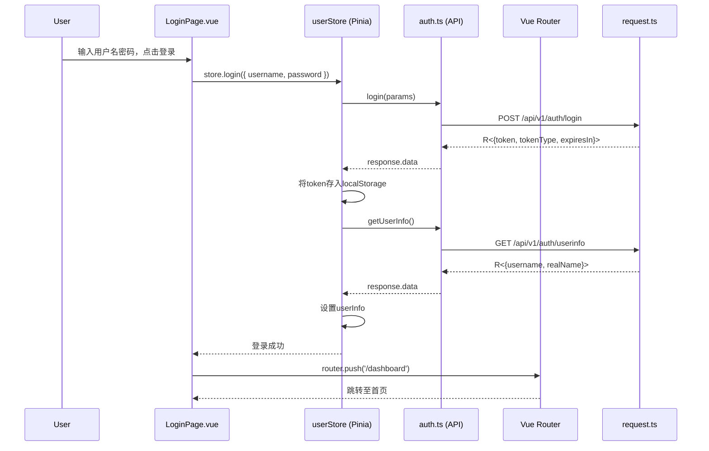
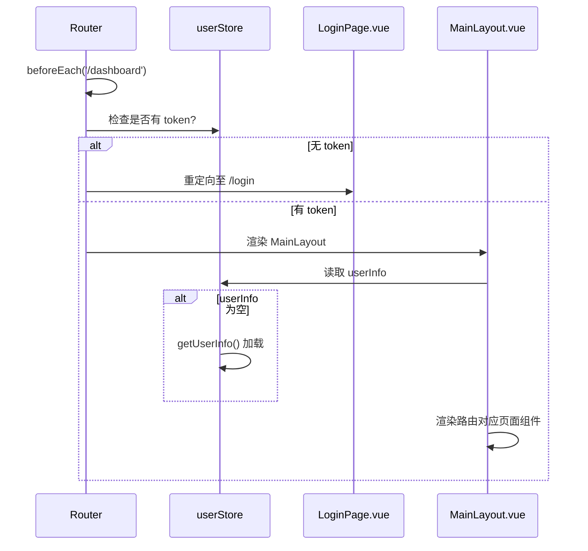
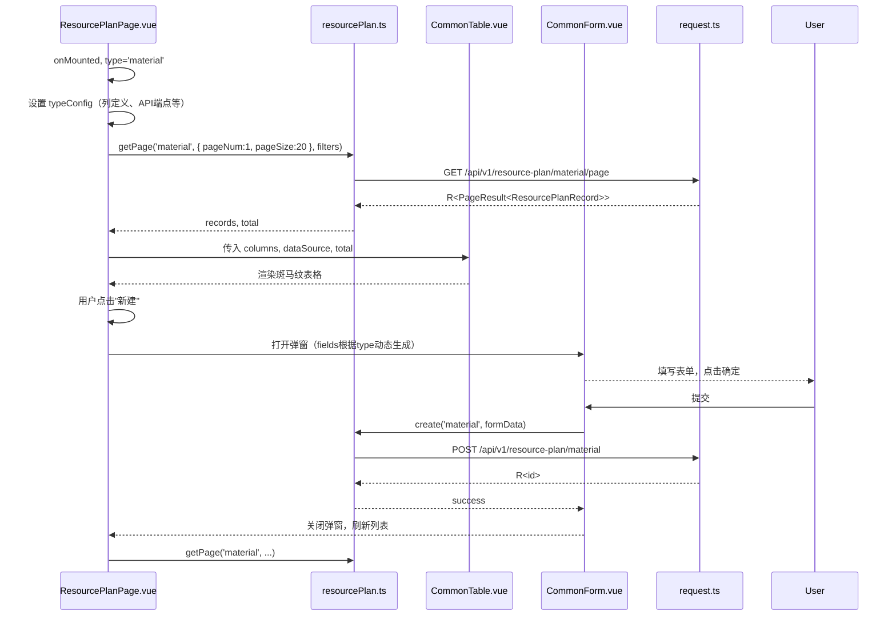
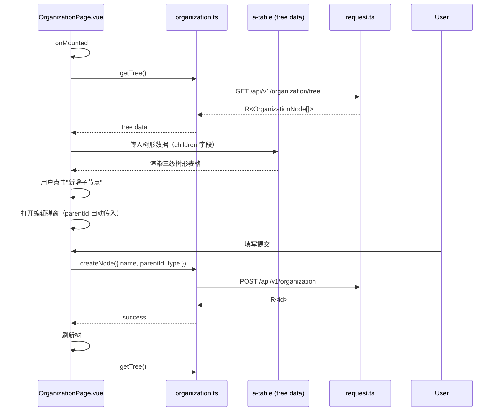
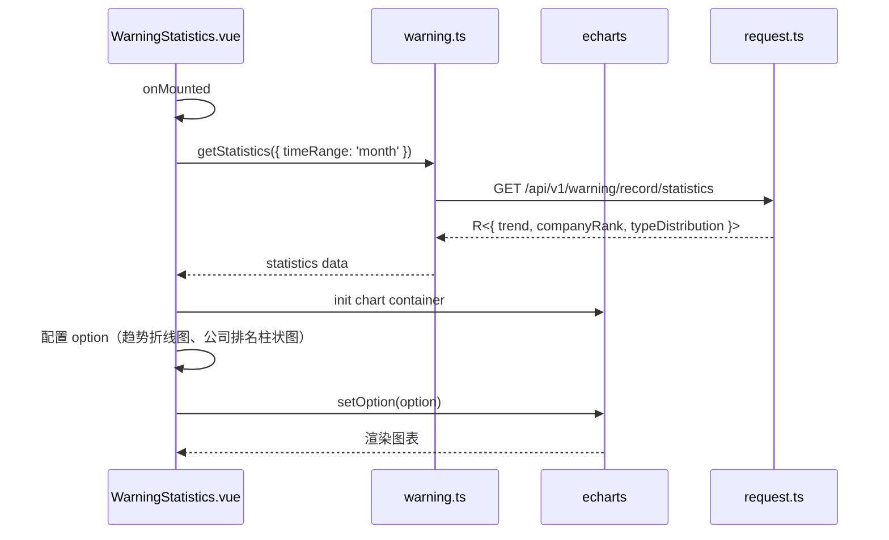
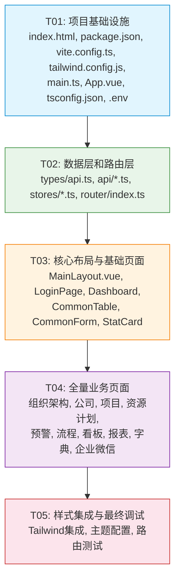

# Frontend2 — 项目资源计划预警系统架构设计文档

| 版本 | 日期 | 作者 | 说明 |
|------|------|------|------|
| 1.0 | 2026-05-11 | 高见远（架构师） | Frontend2 初始架构设计 |

---

## Part A: System Design

### 1. Implementation Approach

#### 1.1 核心技术挑战

| 挑战 | 解决方案 |
|------|----------|
| **8种资源计划类型统一管理** | 使用动态路由 `resource-plan/:type` + 通用 CRUD 组件，通过配置对象差异化字段和API端点 |
| **树形组织架构CRUD** | 利用 Ant Design Vue `a-table` 的 `children` 属性展示三级树结构，配合递归操作 |
| **预警+流程等模块的多子页面路由** | 在 `MainLayout` 的 children 下建立嵌套路由，通过 `a-tabs` 或菜单切换子页面 |
| **Token认证与路由守卫** | 使用路由 `beforeEach` 守卫 + Pinia userStore 统一管理登录状态 |
| **与原后端API100%兼容** | 复用与现有 frontend 相同的 baseURL（`/api`）和 URL 路径模式（`/v1/xxx`）|

#### 1.2 框架与库选型

| 技术 | 版本 | 选型理由 |
|------|------|----------|
| Vite 5 | ^5.x | 极速冷启动和 HMR，官方 Vue-TS 模板 |
| Vue 3 | ^3.4 | Composition API + TypeScript 原生支持 |
| TypeScript | ^5.x | 类型安全，减少运行时错误 |
| Ant Design Vue | ^4.x | 企业级 UI 组件库，专业大气，符合 PRD 设计规范 |
| Tailwind CSS | ^3.x | 原子化 CSS，辅助布局和微调样式 |
| Pinia | ^2.x | Vue 3 官方推荐状态管理，轻量且支持 TypeScript |
| Vue Router 4 | ^4.x | Vue 3 官方路由，支持嵌套路由和路由守卫 |
| Axios | ^1.x | HTTP 客户端，拦截器机制完善 |
| dayjs | ^1.x | Ant Design Vue 内置依赖，日期处理 |
| vue-draggable-plus | ^4.x | 基于 SortableJS 的 Vue 3 拖拽库（看板功能） |
| @ant-design/icons-vue | - | Ant Design 图标库 |
| echarts | ^5.x | 图表展示（预警统计/报表） |

#### 1.3 架构模式

采用 **模块化分层架构**，自上而下分为四层：

```
┌─────────────────────────────────────┐
│        视图层 (views)                │  页面组件 + 公共组件
├─────────────────────────────────────┤
│        路由层 (router)               │  路由配置 + 导航守卫
├─────────────────────────────────────┤
│        状态管理层 (stores)           │  Pinia 状态管理
├─────────────────────────────────────┤
│        API 层 (api)                  │  Axios 封装 + 接口方法
├─────────────────────────────────────┤
│        基础设施 (types/utils)        │  类型定义 + 工具函数
└─────────────────────────────────────┘
```

- **视图层**：组件化和模块化，通用表格/表单抽取为公共组件
- **路由层**：Layout 嵌套路由，登录页独立于 Layout
- **状态管理层**：仅 userStore 存储用户登录态，应用状态（侧边栏折叠）使用 appStore
- **API 层**：统一请求封装，按业务模块拆分为独立文件

---

### 2. File List

```
frontend2/
├── index.html
├── package.json
├── vite.config.ts
├── tailwind.config.js
├── postcss.config.js
├── tsconfig.json
├── tsconfig.node.json
├── env.d.ts
├── .env                          # 开发环境变量
├── .env.production                # 生产环境变量
├── src/
│   ├── main.ts                    # 入口文件：注册 Ant Design Vue + Router + Pinia
│   ├── App.vue                    # 根组件（router-view）
│   │
│   ├── api/                       # API 接口层
│   │   ├── request.ts             # Axios 实例 + 请求/响应拦截器
│   │   ├── auth.ts                # 认证相关 API
│   │   ├── organization.ts        # 组织架构 API
│   │   ├── company.ts             # 公司管理 API
│   │   ├── project.ts             # 项目管理 API
│   │   ├── resourcePlan.ts        # 资源计划统一 API（8种类型）
│   │   ├── warning.ts             # 预警管理 API（记录+规则）
│   │   ├── flowable.ts            # 流程审批 API
│   │   ├── kanban.ts              # 看板 API
│   │   ├── report.ts              # 报表 API
│   │   └── dict.ts                # 字典管理 API
│   │
│   ├── router/
│   │   └── index.ts               # 路由配置 + 导航守卫（beforeEach）
│   │
│   ├── stores/
│   │   ├── user.ts                # 用户状态（token, userInfo, login/logout）
│   │   └── app.ts                 # 应用状态（侧边栏折叠）
│   │
│   ├── types/
│   │   └── api.ts                 # 通用类型 R<T>, PageResult<T>, PageParams
│   │
│   ├── layouts/
│   │   └── MainLayout.vue         # 主布局：深色侧边栏 + 白色顶栏 + 内容区
│   │
│   ├── views/
│   │   ├── login/
│   │   │   └── index.vue          # 登录页（渐变背景，居中卡片）
│   │   ├── dashboard/
│   │   │   └── index.vue          # 工作台首页（统计卡片+待办+预警）
│   │   ├── organization/
│   │   │   └── index.vue          # 组织架构（树形表格）
│   │   ├── company/
│   │   │   └── index.vue          # 公司管理（表格+搜索+弹窗）
│   │   ├── project/
│   │   │   └── index.vue          # 项目管理（表格+搜索+弹窗）
│   │   ├── resource-plan/         # 8种资源计划类型
│   │   │   └── index.vue          # 通用资源计划页面（通过 type 参数区分）
│   │   ├── warning/
│   │   │   ├── board/
│   │   │   │   └── index.vue      # 预警看板
│   │   │   ├── rule/
│   │   │   │   └── index.vue      # 规则配置
│   │   │   ├── history/
│   │   │   │   └── index.vue      # 预警历史
│   │   │   └── statistics/
│   │   │       └── index.vue      # 预警统计
│   │   ├── flowable/
│   │   │   ├── task/
│   │   │   │   └── index.vue      # 待办任务
│   │   │   ├── my-initiated/
│   │   │   │   └── index.vue      # 我发起的
│   │   │   ├── history/
│   │   │   │   └── index.vue      # 审批历史
│   │   │   ├── admin/
│   │   │   │   └── index.vue      # 流程管理
│   │   │   └── designer/
│   │   │       └── index.vue      # 流程设计器
│   │   ├── kanban/
│   │   │   └── index.vue          # 看板
│   │   ├── report/
│   │   │   ├── config.vue         # 自定义报表
│   │   │   ├── preview.vue        # 报表预览
│   │   │   └── export.vue         # 导出中心
│   │   ├── dict/
│   │   │   └── index.vue          # 字典管理
│   │   └── wecom/
│   │       └── config/
│   │           └── index.vue      # 企业微信配置
│   │
│   └── components/                # 公共组件
│       ├── CommonTable.vue        # 通用表格组件（搜索+分页+斑马纹）
│       ├── CommonForm.vue         # 通用表单弹窗组件
│       └── StatCard.vue           # 统计卡片组件
```

---

### 3. Data Structures and Interfaces

#### 3.1 类型定义

```mermaid
classDiagram
    %% ==== 通用响应类型 ====
    class R {
        +number code
        +string message
        +T data
        +number timestamp
    }
    class PageParams {
        +number pageNum
        +number pageSize
    }
    class PageResult {
        +T[] records
        +number total
        +number pageNum
        +number pageSize
    }

    %% ==== 业务模型 ====
    class UserInfo {
        +string username
        +string realName
        +string token
        +string tokenType
        +number expiresIn
    }
    class LoginParams {
        +string username
        +string password
    }
    class OrganizationNode {
        +number id
        +string name
        +string code
        +string type
        +number parentId
        +number sort
        +string status
        +string department
        +string office
        +OrganizationNode[] children
    }
    class CompanyRecord {
        +number id
        +string name
        +string code
        +string contactPerson
        +string contactPhone
        +string status
        +string createTime
    }
    class ProjectRecord {
        +number id
        +string name
        +string code
        +number companyId
        +string companyName
        +string principal
        +string startDate
        +string plannedEndDate
        +string status
    }
    class ResourcePlanRecord {
        +number id
        +number projectId
        +string projectName
        +string resourceType
        +string materialName
        +string spec
        +string unit
        +number quantity
        +string status
        +string createTime
        +string usageLocation
        +string procurementProgress
        +string supplier
        +string shippingStatus
    }
    class WarningRecord {
        +number id
        +string type
        +string level
        +string title
        +string content
        +number companyId
        +number projectId
        +string status
        +string createTime
        +string handleTime
    }
    class WarningRule {
        +number id
        +number companyId
        +string companyName
        +number advanceDays
        +string enableType
        +string notifyChannel
        +string status
    }
    class FlowableTask {
        +string taskId
        +string taskName
        +string processInstanceId
        +string processName
        +string initiator
        +string createTime
        +string status
    }
    class KanbanCard {
        +number id
        +string title
        +string description
        +string column
        +string assignee
        +string priority
        +string dueDate
        +number sort
    }
    class KanbanColumn {
        +string id
        +string title
        +KanbanCard[] cards
    }
    class DictItem {
        +number id
        +string dictType
        +string dictCode
        +string dictValue
        +number sort
        +string status
    }

    %% ==== API Service 类 ====
    class AuthApi {
        +login(LoginParams) Promise~R~UserInfo~~
        +getUserInfo() Promise~R~UserInfo~~
    }
    class OrganizationApi {
        +getTree() Promise~R~OrganizationNode[]~~
        +createNode(OrganizationNode) Promise~R~number~~
        +updateNode(OrganizationNode) Promise~R~boolean~~
        +deleteNode(number) Promise~R~boolean~~
    }
    class CompanyApi {
        +getPage(PageParams, filters) Promise~R~PageResult~CompanyRecord~~~
        +create(CompanyRecord) Promise~R~number~~
        +update(CompanyRecord) Promise~R~boolean~~
        +delete(number) Promise~R~boolean~~
    }
    class ProjectApi {
        +getPage(PageParams, filters) Promise~R~PageResult~ProjectRecord~~~
        +create(ProjectRecord) Promise~R~number~~
        +update(ProjectRecord) Promise~R~boolean~~
        +delete(number) Promise~R~boolean~~
    }
    class ResourcePlanApi {
        +getPage(string type, PageParams, filters) Promise~R~PageResult~ResourcePlanRecord~~~
        +getDetail(string type, number id) Promise~R~ResourcePlanRecord~~
        +create(string type, ResourcePlanRecord) Promise~R~number~~
        +update(string type, ResourcePlanRecord) Promise~R~boolean~~
        +delete(string type, number id) Promise~R~boolean~~
    }
    class WarningApi {
        +getBoardStats() Promise~R~object~~
        +getRecordPage(PageParams, filters) Promise~R~PageResult~WarningRecord~~~
        +getRulePage(PageParams, filters) Promise~R~PageResult~WarningRule~~~
        +createRule(WarningRule) Promise~R~number~~
        +updateRule(WarningRule) Promise~R~boolean~~
        +getStatistics(filters) Promise~R~object~~
    }
    class FlowableApi {
        +getTaskPage(PageParams) Promise~R~PageResult~FlowableTask~~~
        +completeTask(taskId, variables) Promise~R~boolean~~
        +getMyInitiated(PageParams) Promise~R~PageResult~~
        +getHistory(PageParams, filters) Promise~R~PageResult~~
        +getDefinitions() Promise~R~array~~
        +deployProcess(formData) Promise~R~boolean~~
    }
    class KanbanApi {
        +getBoard() Promise~R~KanbanColumn[]~~
        +createCard(KanbanCard) Promise~R~number~~
        +updateCard(KanbanCard) Promise~R~boolean~~
        +deleteCard(number) Promise~R~boolean~~
        +moveCard(cardId, columnId, sort) Promise~R~boolean~~
    }
    class ReportApi {
        +getConfig() Promise~R~object~~
        +saveConfig(config) Promise~R~boolean~~
        +getPreview(filters) Promise~R~object~~
        +getExportPage(PageParams) Promise~R~PageResult~~
        +createExportTask(filters) Promise~R~number~~
        +downloadFile(taskId) Promise~Blob~~
    }
    class DictApi {
        +getTypes() Promise~R~array~~
        +getItems(type, PageParams) Promise~R~PageResult~DictItem~~~
        +createItem(DictItem) Promise~R~number~~
        +updateItem(DictItem) Promise~R~boolean~~
        +deleteItem(number) Promise~R~boolean~~
    }

    %% ==== Store 类 ====
    class UserStore {
        -string token
        -UserInfo userInfo
        +login(LoginParams) Promise~void~~
        +logout() void
        +getInfo() Promise~void~~
        +isLoggedIn() boolean
    }
    class AppStore {
        -boolean sidebarCollapsed
        +toggleSidebar() void
    }

    %% ==== Component Props ====
    class CommonTableProps {
        +object[] columns
        +object[] dataSource
        +number total
        +boolean loading
        +object searchFields
        +event onSearch
        +event onPageChange
        +slot actions
    }
    class CommonFormProps {
        +object[] fields
        +object model
        +boolean visible
        +string title
        +number width
        +event onOk
        +event onCancel
    }
    class StatCardProps {
        +string title
        +number value
        +string icon
        +string color
    }

    %% ==== 关系 ====
    R <|.. PageResult : 嵌套
    PageParams *-- PageResult : 分页输入输出
    OrganizationApi ..> OrganizationNode : 操作
    CompanyApi ..> PageResult~CompanyRecord~ : 返回
    ProjectApi ..> PageResult~ProjectRecord~ : 返回
    ResourcePlanApi ..> PageResult~ResourcePlanRecord~ : 返回
    WarningApi ..> WarningRecord : 操作
    WarningApi ..> WarningRule : 操作
    FlowableApi ..> FlowableTask : 操作
    KanbanApi ..> KanbanCard : 操作
    KanbanApi ..> KanbanColumn : 操作
    DictApi ..> DictItem : 操作
    AuthApi ..> UserInfo : 返回
    UserStore ..> UserInfo : 管理
    UserStore ..> AuthApi : 调用
```



---

### 4. Program Call Flow

#### 4.1 登录流程



#### 4.2 路由守卫流程



#### 4.3 资源计划通用列表流程（以 material 为例）



#### 4.4 组织架构树形表格流程



#### 4.5 预警统计图表流程



---

### 5. Anything UNCLEAR

| # | 问题 | 假设/决策 |
|---|------|-----------|
| 1 | **流程设计器的具体实现方式** | 假设先预留路由和占位页面，使用 iframe 嵌入 Flowable Modeler 或第三方组件，具体集成方案待后续确认 |
| 2 | **8种资源计划的字段差异** | 假设先为 `material` 开发完整 CRUD，其余 7 种通过 `typeConfig` 配置对象差异化字段名和 API 路径，若实际差异较大再拆分为独立组件 |
| 3 | **看板拖拽的后端API格式** | 假设后端返回 `KanbanColumn[]` 格式（columns包含cards数组），拖拽后调用 `moveCard` 接口持久化排序 |
| 4 | **报表模块的详细配置维度** | 假设报表为表格+图表混合展示，具体数据维度待与后端对接确认 |
| 5 | **企业微信配置页字段** | 假设为 CorpID、AgentID、Secret 三个配置项 + 测试连接按钮 |
| 6 | **字典管理的多类型切换** | 假设左侧使用 a-tree 或 a-select 选择字典类型，右侧展示对应字典值列表 |

---

## Part B: Task Decomposition

### 6. Required Packages

```
vue@^3.4.0             # 前端框架
typescript@^5.3.0       # 类型安全
vite@^5.4.0             # 构建工具
@vitejs/plugin-vue@^5.0.0  # Vite Vue 插件
ant-design-vue@^4.x     # UI 组件库
@ant-design/icons-vue   # 图标库
pinia@^2.1.0            # 状态管理
vue-router@^4.3.0       # 路由
axios@^1.7.0            # HTTP 请求
dayjs@^1.11.0           # 日期处理（Ant Design Vue 内置依赖）
echarts@^5.5.0          # 图表库
vue-draggable-plus@^0.5.0  # 拖拽组件（看板）
tailwindcss@^3.4.0      # 原子化 CSS
postcss@^8.4.0          # CSS 处理器
autoprefixer@^10.4.0    # CSS 自动前缀
@types/node@^20.0.0     # Node 类型
```

### 7. Task List (ordered by dependency)

#### T01: 项目基础设施

| 属性 | 值 |
|------|-----|
| **Task ID** | T01 |
| **Task Name** | 项目基础设施搭建 |
| **Source Files** | `index.html`, `package.json`, `vite.config.ts`, `tailwind.config.js`, `postcss.config.js`, `tsconfig.json`, `tsconfig.node.json`, `env.d.ts`, `.env`, `.env.production`, `src/main.ts`, `src/App.vue` |
| **Dependencies** | 无（首个任务） |
| **Priority** | P0 |

**内容说明**：
1. `npm create vite@latest frontend2 -- --template vue-ts` 初始化项目
2. 安装所有依赖（ant-design-vue, pinia, vue-router, axios, echarts, vue-draggable-plus, tailwindcss 等）
3. 配置 `vite.config.ts`：proxy（`/api` → 后端地址）、路径别名 `@` → `src`、unplugin-auto-import
4. 配置 `tailwind.config.js` + `postcss.config.js`
5. 创建 `.env`（`VITE_API_BASE=/api`）和 `.env.production`
6. 创建 `src/main.ts`：注册 Ant Design Vue、Pinia、Router
7. 创建 `src/App.vue`：根组件 `router-view`

#### T02: 数据层（类型 + API + 状态管理 + 路由）

| 属性 | 值 |
|------|-----|
| **Task ID** | T02 |
| **Task Name** | 数据层和路由层搭建 |
| **Source Files** | `src/types/api.ts`, `src/api/request.ts`, `src/api/auth.ts`, `src/api/organization.ts`, `src/api/company.ts`, `src/api/project.ts`, `src/api/resourcePlan.ts`, `src/api/warning.ts`, `src/api/flowable.ts`, `src/api/kanban.ts`, `src/api/report.ts`, `src/api/dict.ts`, `src/stores/user.ts`, `src/stores/app.ts`, `src/router/index.ts` |
| **Dependencies** | T01 |
| **Priority** | P0 |

**内容说明**：
1. `types/api.ts`：定义 `R<T>`, `PageParams`, `PageResult` 通用类型
2. `api/request.ts`：Axios 实例 + token 注入拦截器 + 错误和401响应拦截器
3. `api/auth.ts` ~ `api/dict.ts`：10个 API 模块，与现有后端端点兼容（路径 `/v1/xxx`）
4. `stores/user.ts`：Pinia userStore（token管理、login/logout、userInfo）
5. `stores/app.ts`：Pinia appStore（侧边栏折叠状态）
6. `router/index.ts`：所有路由配置 + `beforeEach` 路由守卫（检查token，无token跳转login）

#### T03: 布局 + 登录 + 首页 + 核心公共组件

| 属性 | 值 |
|------|-----|
| **Task ID** | T03 |
| **Task Name** | 核心布局与基础页面开发 |
| **Source Files** | `src/layouts/MainLayout.vue`, `src/views/login/index.vue`, `src/views/dashboard/index.vue`, `src/components/StatCard.vue`, `src/components/CommonTable.vue`, `src/components/CommonForm.vue` |
| **Dependencies** | T02 |
| **Priority** | P0 |

**内容说明**：
1. `MainLayout.vue`：a-layout + a-layout-sider（深色#001529）+ a-layout-header（白色）+ a-layout-content（#f0f2f5），支持侧边栏折叠，面包屑导航
2. `login/index.vue`：渐变背景 + 居中卡片 + 用户名密码表单 + 回车提交
3. `dashboard/index.vue`：统计卡片（StatCard × 4）+ 待办任务列表 + 预警概览
4. `StatCard.vue`：通用统计卡片组件（title/value/icon/color）
5. `CommonTable.vue`：通用表格（搜索区 + 斑马纹 a-table + 分页，slot扩展操作栏）
6. `CommonForm.vue`：通用表单弹窗（a-modal + a-form，动态字段渲染）

#### T04: 业务页面开发（组织架构/公司/项目/资源计划/预警/流程/看板/报表/字典）

| 属性 | 值 |
|------|-----|
| **Task ID** | T04 |
| **Task Name** | 全量业务页面开发 |
| **Source Files** | `src/views/organization/index.vue`, `src/views/company/index.vue`, `src/views/project/index.vue`, `src/views/resource-plan/index.vue`, `src/views/warning/board/index.vue`, `src/views/warning/rule/index.vue`, `src/views/warning/history/index.vue`, `src/views/warning/statistics/index.vue`, `src/views/flowable/task/index.vue`, `src/views/flowable/my-initiated/index.vue`, `src/views/flowable/history/index.vue`, `src/views/flowable/admin/index.vue`, `src/views/flowable/designer/index.vue`, `src/views/kanban/index.vue`, `src/views/report/config.vue`, `src/views/report/preview.vue`, `src/views/report/export.vue`, `src/views/dict/index.vue`, `src/views/wecom/config/index.vue` |
| **Dependencies** | T03 |
| **Priority** | P0 (大部分) / P1-P2（看板/报表/企业微信） |

**内容说明**：
1. **组织架构**：树形表格（局-公司-项目三级），CRUD 弹窗操作
2. **公司管理**：表格+搜索+新建/编辑弹窗
3. **项目管理**：表格+搜索+新建/编辑弹窗
4. **资源计划**：8种类型统一页面，通过 type 参数动态配置列和API端点
5. **预警看板**：统计卡片 + 预警分布图表（echarts）
6. **预警规则**：CRUD 表格
7. **预警历史**：筛选表格 + 导出
8. **预警统计**：echarts 趋势图 + 排名图
9. **流程待办**：表格 + 审批弹窗
10. **我发起的 / 审批历史**：筛选表格
11. **流程管理**：流程定义 CRUD + 部署
12. **流程设计器**：占位页面（集成待后续）
13. **看板**：vue-draggable-plus 拖拽看板
14. **报表**：配置/预览/导出三个子页面
15. **字典管理**：字典类型选择 + 字典值 CRUD 表格
16. **企业微信**：配置表单页

#### T05: 样式集成 + 全局配置 + 最终调试

| 属性 | 值 |
|------|-----|
| **Task ID** | T05 |
| **Task Name** | 样式集成与最终调试 |
| **Source Files** | 全局影响：`src/main.ts`（全局样式注册）、`tailwind.config.js`已配置；各页面微调样式 |
| **Dependencies** | T04 |
| **Priority** | P0 |

**内容说明**：
1. 全局 CSS 注入：Tailwind CSS 指令（`@tailwind base/components/utilities`）+ Ant Design Vue 主题覆盖
2. Ant Design Vue 配置主题色（`#1890ff` 主色），通过 `ConfigProvider` 包裹全局
3. 斑马纹表格全局样式（`.table-row-striped` 浅灰背景）
4. 侧边栏菜单样式、内容区间距等统一样式调整
5. 全量路由测试：确保所有页面可正常加载，API 调用正常
6. 检查 401 跳转、登录态保持、退出登录等功能完整性

### 8. Shared Knowledge

#### 8.1 API 规范
- 所有请求使用统一 `baseURL: '/api'`（通过 Vite proxy 转发到后端）
- API 路径统一为 `/v1/xxx` 简写格式（例如认证：`/api/v1/auth/login`）
- 所有响应格式均为 `R<T>`：`{ code: number, message: string, data: T, timestamp: number }`
- 分页请求参数：`{ pageNum: number, pageSize: number }`
- 分页响应数据：`{ records: T[], total: number, pageNum: number, pageSize: number }`
- 认证使用 Bearer Token 方式，通过请求拦截器自动注入
- Token 存储 Key：`rpw_token`（与现有 frontend 兼容）
- 响应拦截器处理：`code !== 200` 为业务错误，显示错误提示；401 清除 token 并跳转登录

#### 8.2 路由规范
- 所有页面路径使用 `history` 模式
- 登录页（`/login`）不经过 MainLayout，`meta.requiresAuth = false`
- 其他所有页面嵌套在 MainLayout 内，`meta.requiresAuth = true`
- 路由守卫 `beforeEach`：无 token 且目标页需要认证 → 重定向 `/login`
- 路由 meta 字段：`title`（页面标题，用于面包屑和 document.title）

#### 8.3 样式规范
- **主色**：`#1890ff`（Ant Design Blue）
- **侧边栏**：背景 `#001529`，文字白色，选中项高亮主色
- **顶部栏**：白色 `#fff`
- **内容区背景**：`#f0f2f5`
- **卡片**：圆角 8px，白色背景，轻微阴影
- **表格**：斑马纹（奇数行浅灰背景），固定表头
- **字体**：系统默认字体栈 `-apple-system, BlinkMacSystemFont, "Segoe UI", Roboto, "Helvetica Neue", Arial, sans-serif`
- 混合使用 Tailwind CSS 和 Ant Design Vue 样式，Tailwind 只做辅助布局

#### 8.4 组件规范
- `CommonTable.vue`：通用表格组件，支持搜索区域 slot、分页、斑马纹
  - Props: `columns`, `dataSource`, `total`, `loading`, `searchFields`
  - Events: `onSearch`, `onPageChange`, `onAdd`, `onEdit`, `onDelete`
- `CommonForm.vue`：通用表单弹窗组件，支持动态字段渲染
  - Props: `fields`, `model`, `visible`, `title`
  - Events: `onOk`, `onCancel`
- `StatCard.vue`：统计卡片组件
  - Props: `title`, `value`, `icon`, `color`

#### 8.5 资源计划类型配置
```typescript
// 8种资源计划类型的统一配置结构
const resourcePlanTypes = {
  material:     { label: '材料计划',     apiPrefix: '/v1/resource-plan/material' },
  equipment:    { label: '设备计划',     apiPrefix: '/v1/resource-plan/equipment' },
  hardware:     { label: '五金计划',     apiPrefix: '/v1/resource-plan/hardware' },
  circulation:  { label: '周转材计划',   apiPrefix: '/v1/resource-plan/circulation' },
  office:       { label: '办公用品计划', apiPrefix: '/v1/resource-plan/office' },
  safety:       { label: '安全物资计划', apiPrefix: '/v1/resource-plan/safety' },
  subcontract:  { label: '分包计划',     apiPrefix: '/v1/resource-plan/subcontract' },
  labor:        { label: '劳动力计划',   apiPrefix: '/v1/resource-plan/labor' },
}
```

#### 8.6 环境变量
```
VITE_API_BASE=/api               # 开发环境 API 基础路径
VITE_APP_TITLE=资源计划预警系统     # 应用标题
```

### 9. Task Dependency Graph


