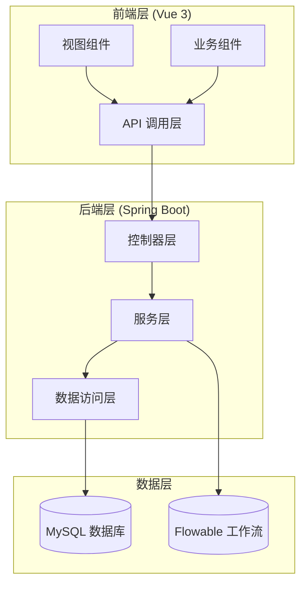
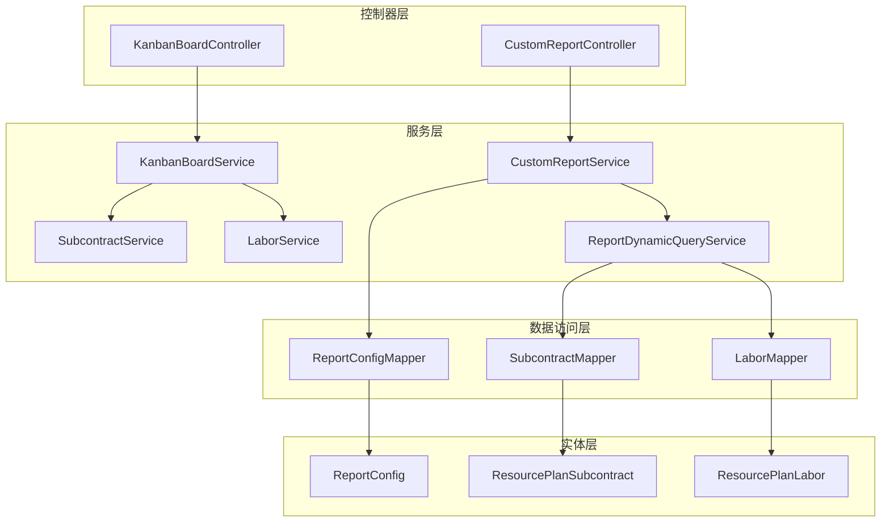
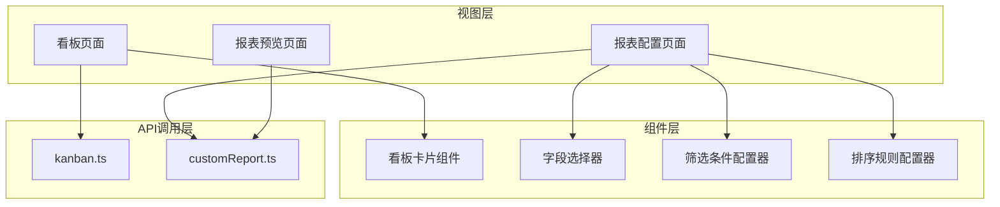
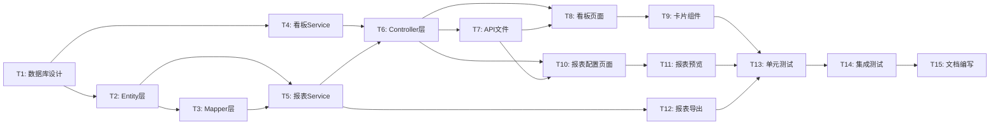
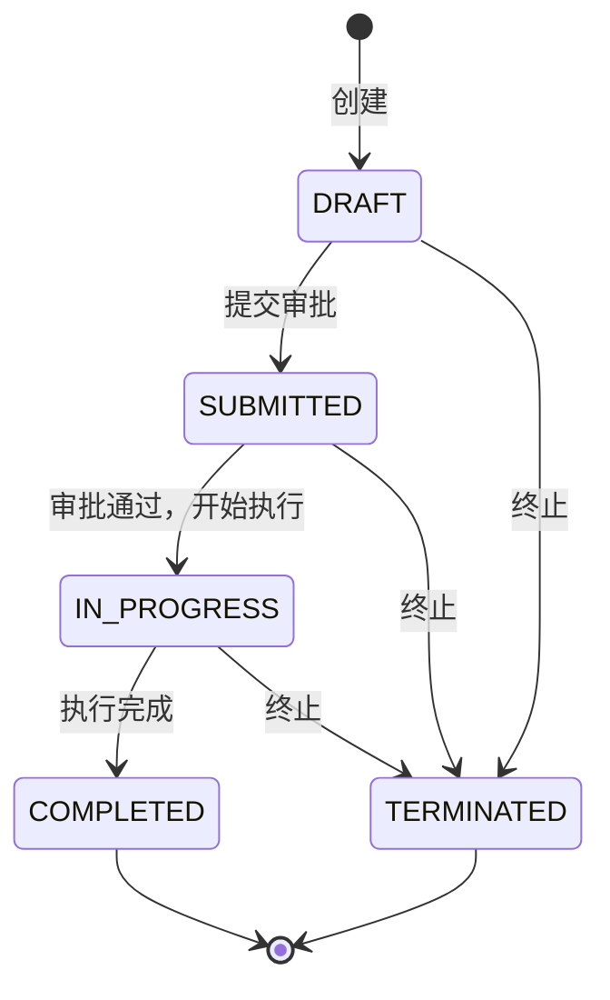

# Phase 7 技术架构设计文档

## 目录

1. [概述](#1-概述)
2. [数据库设计](#2-数据库设计)
3. [后端架构设计](#3-后端架构设计)
4. [前端架构设计](#4-前端架构设计)
5. [任务分解](#5-任务分解)
6. [技术风险与应对](#6-技术风险与应对)

---

## 1. 概述

### 1.1 项目背景

Phase 7 在现有 RPW（资源计划工作流）系统基础上，新增两个核心功能模块：

1. **看板（Kanban Board）**：可视化展示资源计划执行状态，支持拖拽更新状态
2. **自定义报表（Custom Report）**：用户可自定义报表字段、筛选条件、排序规则

### 1.2 技术栈

| 层级 | 技术 |
|------|------|
| 后端框架 | Spring Boot 3.1.6 |
| ORM | MyBatis Plus |
| 工作流引擎 | Flowable 7.0.0 |
| 前端框架 | Vue 3 + TypeScript |
| UI 组件库 | Element Plus |
| 拖拽组件 | vue-draggable-plus |
| 报表导出 | Apache POI (Excel)、iText (PDF) |

### 1.3 现有系统架构



---

## 2. 数据库设计

### 2.1 现有表结构（简要说明）

| 表名 | 说明 | 核心字段 |
|------|------|----------|
| `resource_plan_subcontract` | 分包计划 | id, project_id, wbs_code, status, approval_status |
| `resource_plan_labor` | 劳动力计划 | id, project_id, wbs_code, status, plan_quantity |
| `resource_plan_equipment` | 设备计划 | id, project_id, equipment_name, status |
| `resource_plan_material` | 材料计划 | id, project_id, material_name, status |
| `resource_plan_safety` | 安全资源计划 | id, project_id, safety_type, status |
| `resource_plan_office` | 办公资源计划 | id, project_id, office_type, status |
| `resource_plan_hardware` | 硬件计划 | id, project_id, hardware_name, status |
| `resource_plan_circulation` | 流通资源计划 | id, project_id, circulation_type, status |
| `project` | 项目信息 | id, project_name, project_code |
| `company` | 公司信息 | id, company_name |
| `organization` | 组织信息 | id, org_name |

所有表均继承 `BaseEntity` 字段：
- `id`：主键（自增）
- `create_time`：创建时间（自动填充）
- `update_time`：更新时间（自动填充）
- `deleted`：逻辑删除标记（0-未删除，1-已删除）

### 2.2 看板功能：数据库变更

看板功能主要依赖现有表，无需新增表。需要新增/修改的字段：

#### 2.2.1 新增字段：`board_column`（可选）

如果需要进行看板列配置，可新增配置表：

```sql
-- 看板列配置表（可选，用于自定义看板列）
CREATE TABLE IF NOT EXISTS kanban_column_config (
    id BIGINT AUTO_INCREMENT PRIMARY KEY,
    column_key VARCHAR(50) NOT NULL COMMENT '列标识（如：DRAFT, SUBMITTED, IN_PROGRESS, COMPLETED）',
    column_name VARCHAR(100) NOT NULL COMMENT '列名称（如：草稿、已提交、进行中、已完成）',
    column_order INT NOT NULL DEFAULT 0 COMMENT '列排序',
    status_value VARCHAR(50) NOT NULL COMMENT '对应的状态值',
    created_time DATETIME DEFAULT CURRENT_TIMESTAMP,
    updated_time DATETIME DEFAULT CURRENT_TIMESTAMP ON UPDATE CURRENT_TIMESTAMP,
    deleted INT DEFAULT 0,
    UNIQUE KEY uk_column_key (column_key)
) ENGINE=InnoDB DEFAULT CHARSET=utf8mb4 COMMENT='看板列配置表';
```

**推荐方案**：前端硬编码看板列配置，减少后端复杂度。状态值直接使用现有 `status` 字段。

### 2.3 自定义报表：新增表

#### 2.3.1 报表配置表 `report_config`

```sql
CREATE TABLE IF NOT EXISTS report_config (
    id BIGINT AUTO_INCREMENT PRIMARY KEY,
    user_id BIGINT NOT NULL COMMENT '用户ID',
    report_name VARCHAR(100) NOT NULL COMMENT '报表名称',
    report_type VARCHAR(50) NOT NULL COMMENT '报表类型（SUBTRACT-分包, LABOR-劳动力, EQUIPMENT-设备, etc.）',
    config_json TEXT NOT NULL COMMENT '配置JSON（字段、筛选条件、排序规则）',
    is_default TINYINT DEFAULT 0 COMMENT '是否默认配置（0-否，1-是）',
    created_time DATETIME DEFAULT CURRENT_TIMESTAMP,
    updated_time DATETIME DEFAULT CURRENT_TIMESTAMP ON UPDATE CURRENT_TIMESTAMP,
    deleted INT DEFAULT 0,
    INDEX idx_user_id (user_id),
    INDEX idx_report_type (report_type)
) ENGINE=InnoDB DEFAULT CHARSET=utf8mb4 COMMENT='报表配置表';
```

#### 2.3.2 `config_json` 字段结构示例

```json
{
  "fields": [
    {"field": "wbsCode", "label": "WBS编码", "visible": true},
    {"field": "subcontractName", "label": "分包项目名称", "visible": true},
    {"field": "status", "label": "状态", "visible": true},
    {"field": "planStartDate", "label": "计划开始日期", "visible": true},
    {"field": "actualStartDate", "label": "实际开始日期", "visible": false}
  ],
  "filters": [
    {"field": "status", "operator": "EQ", "value": "IN_PROGRESS"},
    {"field": "planStartDate", "operator": "BETWEEN", "value": ["2026-05-01", "2026-05-31"]}
  ],
  "sorts": [
    {"field": "planStartDate", "order": "DESC"}
  ]
}
```

#### 2.3.3 报表导出记录表 `report_export_log`（可选）

```sql
CREATE TABLE IF NOT EXISTS report_export_log (
    id BIGINT AUTO_INCREMENT PRIMARY KEY,
    user_id BIGINT NOT NULL COMMENT '用户ID',
    report_config_id BIGINT COMMENT '报表配置ID',
    export_type VARCHAR(20) NOT NULL COMMENT '导出类型（EXCEL, PDF）',
    file_path VARCHAR(500) COMMENT '文件路径',
    record_count INT DEFAULT 0 COMMENT '导出记录数',
    export_time DATETIME DEFAULT CURRENT_TIMESTAMP,
    INDEX idx_user_id (user_id),
    INDEX idx_export_time (export_time)
) ENGINE=InnoDB DEFAULT CHARSET=utf8mb4 COMMENT='报表导出记录表';
```

---

## 3. 后端架构设计

### 3.1 看板功能后端设计

#### 3.1.1 Controller 设计：`KanbanBoardController`

```java
package com.company.rpw.controller;

import com.company.rpw.common.R;
import com.company.rpw.dto.kanban.KanbanBoardVO;
import com.company.rpw.dto.kanban.KanbanCardDTO;
import com.company.rpw.service.KanbanBoardService;
import lombok.RequiredArgsConstructor;
import lombok.extern.slf4j.Slf4j;
import org.springframework.web.bind.annotation.*;

/**
 * 看板控制器
 */
@Slf4j
@RestController
@RequestMapping("/api/v1/kanban")
@RequiredArgsConstructor
public class KanbanBoardController {

    private final KanbanBoardService kanbanBoardService;

    /**
     * 获取看板数据
     * GET /api/v1/kanban/board
     * @param projectId 项目ID（可选）
     * @param resourceType 资源类型（可选：SUBTRACT, LABOR, EQUIPMENT, etc.）
     * @return 看板数据（按状态分组的卡片列表）
     */
    @GetMapping("/board")
    public R<KanbanBoardVO> getBoardData(
            @RequestParam(required = false) Long projectId,
            @RequestParam(required = false) String resourceType) {
        KanbanBoardVO boardData = kanbanBoardService.getBoardData(projectId, resourceType);
        return R.ok(boardData);
    }

    /**
     * 拖动卡片更新状态
     * PUT /api/v1/kanban/card/status
     * @param dto 卡片状态更新DTO（id, resourceType, newStatus）
     * @return 是否成功
     */
    @PutMapping("/card/status")
    public R<Boolean> updateCardStatus(@RequestBody KanbanCardDTO dto) {
        boolean result = kanbanBoardService.updateCardStatus(dto);
        return result ? R.ok(true) : R.fail(500, "更新状态失败");
    }

    /**
     * 获取看板列配置
     * GET /api/v1/kanban/columns
     * @return 看板列配置列表
     */
    @GetMapping("/columns")
    public R<List<KanbanColumnVO>> getColumnConfig() {
        return R.ok(kanbanBoardService.getColumnConfig());
    }
}
```

#### 3.1.2 Service 设计：`KanbanBoardService`

```java
package com.company.rpw.service;

import com.company.rpw.dto.kanban.KanbanBoardVO;
import com.company.rpw.dto.kanban.KanbanCardDTO;
import lombok.extern.slf4j.Slf4j;
import org.springframework.stereotype.Service;

import java.util.List;

/**
 * 看板服务类
 */
@Slf4j
@Service
public class KanbanBoardService {

    private final ResourcePlanSubcontractService subcontractService;
    private final ResourcePlanLaborService laborService;
    // ... 其他资源服务

    /**
     * 获取看板数据
     * @param projectId 项目ID（可选）
     * @param resourceType 资源类型（可选）
     * @return 看板数据
     */
    public KanbanBoardVO getBoardData(Long projectId, String resourceType) {
        KanbanBoardVO vo = new KanbanBoardVO();
        
        // 如果未指定资源类型，返回所有类型的卡片
        if (resourceType == null || "SUBTRACT".equals(resourceType)) {
            vo.getColumns().addAll(buildSubcontractCards(projectId));
        }
        if (resourceType == null || "LABOR".equals(resourceType)) {
            vo.getColumns().addAll(buildLaborCards(projectId));
        }
        // ... 其他资源类型
        
        return vo;
    }

    /**
     * 更新卡片状态（拖拽后调用）
     * @param dto 卡片状态更新DTO
     * @return 是否成功
     */
    public boolean updateCardStatus(KanbanCardDTO dto) {
        // 根据资源类型调用对应的服务更新状态
        // 需要校验状态流转的合法性
        return switch (dto.getResourceType()) {
            case "SUBTRACT" -> updateSubcontractStatus(dto);
            case "LABOR" -> updateLaborStatus(dto);
            // ... 其他资源类型
            default -> false;
        };
    }

    /**
     * 获取看板列配置
     * @return 列配置列表
     */
    public List<KanbanColumnVO> getColumnConfig() {
        // 可以从数据库读取，或返回硬编码配置
        return List.of(
            new KanbanColumnVO("DRAFT", "草稿", 1),
            new KanbanColumnVO("SUBMITTED", "已提交", 2),
            new KanbanColumnVO("IN_PROGRESS", "进行中", 3),
            new KanbanColumnVO("COMPLETED", "已完成", 4),
            new KanbanColumnVO("TERMINATED", "已终止", 5)
        );
    }
}
```

#### 3.1.3 DTO/VO 设计

```java
// KanbanBoardVO.java - 看板数据视图对象
@Data
public class KanbanBoardVO {
    private List<KanbanColumnVO> columns;
    private int totalCards;
}

// KanbanColumnVO.java - 看板列视图对象
@Data
public class KanbanColumnVO {
    private String statusKey;       // 状态标识
    private String statusName;       // 状态名称
    private int order;              // 排序
    private List<KanbanCardVO> cards; // 该列下的卡片
}

// KanbanCardVO.java - 看板卡片视图对象
@Data
public class KanbanCardVO {
    private Long id;
    private String resourceType;    // 资源类型
    private String wbsCode;
    private String resourceName;    // 资源名称（分包名称、劳动力类型等）
    private String status;
    private String responsiblePerson; // 负责人
    private LocalDate planStartDate;
    private LocalDate planEndDate;
    private String priority;        // 优先级（可选）
}

// KanbanCardDTO.java - 卡片状态更新DTO
@Data
public class KanbanCardDTO {
    @NotNull
    private Long id;
    @NotBlank
    private String resourceType;    // SUBTRACT, LABOR, etc.
    @NotBlank
    private String newStatus;       // 新状态
    private String remark;          // 备注（可选）
}
```

### 3.2 自定义报表后端设计

#### 3.2.1 Controller 设计：`CustomReportController`

```java
package com.company.rpw.controller;

import com.company.rpw.common.R;
import com.company.rpw.dto.report.ReportConfigDTO;
import com.company.rpw.dto.report.ReportQueryDTO;
import com.company.rpw.dto.report.ReportResultVO;
import com.company.rpw.service.CustomReportService;
import lombok.RequiredArgsConstructor;
import lombok.extern.slf4j.Slf4j;
import org.springframework.web.bind.annotation.*;

import javax.servlet.http.HttpServletResponse;
import java.util.List;

/**
 * 自定义报表控制器
 */
@Slf4j
@RestController
@RequestMapping("/api/v1/report")
@RequiredArgsConstructor
public class CustomReportController {

    private final CustomReportService reportService;

    /**
     * 保存报表配置
     * POST /api/v1/report/config
     */
    @PostMapping("/config")
    public R<Long> saveConfig(@RequestBody ReportConfigDTO dto) {
        Long configId = reportService.saveConfig(dto);
        return R.ok(configId);
    }

    /**
     * 获取报表配置列表
     * GET /api/v1/report/config/list
     */
    @GetMapping("/config/list")
    public R<List<ReportConfigVO>> getConfigList(
            @RequestParam String reportType,
            @RequestParam Long userId) {
        return R.ok(reportService.getConfigList(userId, reportType));
    }

    /**
     * 获取报表配置详情
     * GET /api/v1/report/config/{id}
     */
    @GetMapping("/config/{id}")
    public R<ReportConfigVO> getConfigById(@PathVariable Long id) {
        return R.ok(reportService.getConfigById(id));
    }

    /**
     * 删除报表配置
     * DELETE /api/v1/report/config/{id}
     */
    @DeleteMapping("/config/{id}")
    public R<Boolean> deleteConfig(@PathVariable Long id) {
        return R.ok(reportService.deleteConfig(id));
    }

    /**
     * 预览报表数据
     * POST /api/v1/report/preview
     */
    @PostMapping("/preview")
    public R<ReportResultVO> previewReport(@RequestBody ReportQueryDTO dto) {
        return R.ok(reportService.previewReport(dto));
    }

    /**
     * 导出报表为 Excel
     * POST /api/v1/report/export/excel
     */
    @PostMapping("/export/excel")
    public void exportExcel(@RequestBody ReportQueryDTO dto, HttpServletResponse response) {
        reportService.exportExcel(dto, response);
    }

    /**
     * 导出报表为 PDF
     * POST /api/v1/report/export/pdf
     */
    @PostMapping("/export/pdf")
    public void exportPdf(@RequestBody ReportQueryDTO dto, HttpServletResponse response) {
        reportService.exportPdf(dto, response);
    }
}
```

#### 3.2.2 Service 设计：`CustomReportService`

```java
package com.company.rpw.service;

import com.baomidou.mybatisplus.core.conditions.query.QueryWrapper;
import com.company.rpw.entity.ReportConfig;
import com.company.rpw.mapper.ReportConfigMapper;
import com.company.rpw.dto.report.ReportQueryDTO;
import com.company.rpw.dto.report.ReportResultVO;
import lombok.extern.slf4j.Slf4j;
import org.springframework.stereotype.Service;

import java.util.List;
import java.util.Map;

/**
 * 自定义报表服务类
 */
@Slf4j
@Service
public class CustomReportService {

    private final ReportConfigMapper reportConfigMapper;
    private final ReportDynamicQueryService dynamicQueryService;

    /**
     * 保存报表配置
     */
    public Long saveConfig(ReportConfigDTO dto) {
        ReportConfig config = new ReportConfig();
        config.setUserId(dto.getUserId());
        config.setReportName(dto.getReportName());
        config.setReportType(dto.getReportType());
        config.setConfigJson(dto.getConfigJson());
        config.setDefault(dto.getIsDefault() ? 1 : 0);
        
        reportConfigMapper.insert(config);
        return config.getId();
    }

    /**
     * 预览报表数据（动态查询）
     */
    public ReportResultVO previewReport(ReportQueryDTO dto) {
        // 解析配置JSON
        ReportConfigJson config = parseConfigJson(dto.getConfigJson());
        
        // 动态构建查询条件
        QueryWrapper<?> queryWrapper = buildDynamicQueryWrapper(config);
        
        // 执行查询
        List<Map<String, Object>> data = dynamicQueryService.dynamicQuery(dto.getReportType(), queryWrapper);
        
        // 构建返回结果
        ReportResultVO vo = new ReportResultVO();
        vo.setFields(config.getFields().stream().filter(f -> f.getVisible()).toList());
        vo.setData(data);
        vo.setTotal(data.size());
        
        return vo;
    }

    /**
     * 动态构建查询条件
     */
    private QueryWrapper<?> buildDynamicQueryWrapper(ReportConfigJson config) {
        QueryWrapper<?> wrapper = new QueryWrapper<>();
        
        // 添加筛选条件
        for (ReportFilter filter : config.getFilters()) {
            switch (filter.getOperator()) {
                case "EQ" -> wrapper.eq(filter.getField(), filter.getValue());
                case "NE" -> wrapper.ne(filter.getField(), filter.getValue());
                case "LIKE" -> wrapper.like(filter.getField(), filter.getValue());
                case "GT" -> wrapper.gt(filter.getField(), filter.getValue());
                case "LT" -> wrapper.lt(filter.getField(), filter.getValue());
                case "BETWEEN" -> {
                    List<Object> values = (List<Object>) filter.getValue();
                    wrapper.between(filter.getField(), values.get(0), values.get(1));
                }
            }
        }
        
        // 添加排序规则
        for (ReportSort sort : config.getSorts()) {
            if ("ASC".equals(sort.getOrder())) {
                wrapper.orderByAsc(sort.getField());
            } else {
                wrapper.orderByDesc(sort.getField());
            }
        }
        
        return wrapper;
    }
}
```

#### 3.2.3 Entity 设计：`ReportConfig`

```java
package com.company.rpw.entity;

import com.baomidou.mybatisplus.annotation.*;
import com.company.rpw.common.BaseEntity;
import lombok.Data;
import lombok.EqualsAndHashCode;

/**
 * 报表配置实体类
 */
@Data
@EqualsAndHashCode(callSuper = true)
@TableName("report_config")
public class ReportConfig extends BaseEntity {

    /** 用户ID */
    private Long userId;

    /** 报表名称 */
    private String reportName;

    /** 报表类型（SUBTRACT-分包, LABOR-劳动力, etc.） */
    private String reportType;

    /** 配置JSON */
    @TableField(typeHandler = JacksonTypeHandler.class)  // 需要配置MyBatis JSON类型处理器
    private String configJson;

    /** 是否默认配置（0-否，1-是） */
    @TableField(fill = FieldFill.INSERT)
    private Integer isDefault;
}
```

#### 3.2.4 Mapper 设计：`ReportConfigMapper`

```java
package com.company.rpw.mapper;

import com.baomidou.mybatisplus.core.mapper.BaseMapper;
import com.company.rpw.entity.ReportConfig;
import org.apache.ibatis.annotations.Mapper;

/**
 * 报表配置 Mapper
 */
@Mapper
public interface ReportConfigMapper extends BaseMapper<ReportConfig> {
}
```

### 3.3 后端架构图



---

## 4. 前端架构设计

### 4.1 路由设计

```typescript
// router/index.ts
const routes = [
  {
    path: '/kanban',
    name: 'KanbanBoard',
    component: () => import('@/views/kanban/index.vue'),
    meta: { title: '看板' }
  },
  {
    path: '/report',
    name: 'CustomReport',
    component: () => import('@/views/report/index.vue'),
    meta: { title: '自定义报表' }
  },
  {
    path: '/report/config',
    name: 'ReportConfig',
    component: () => import('@/views/report/config.vue'),
    meta: { title: '报表配置' }
  }
]
```

### 4.2 看板页面设计

#### 4.2.1 页面结构

```vue
<!-- views/kanban/index.vue -->
<template>
  <div class="kanban-container">
    <!-- 筛选栏 -->
    <el-card class="filter-card">
      <el-form :inline="true">
        <el-form-item label="项目">
          <el-select v-model="filter.projectId" placeholder="全部项目" clearable>
            <el-option v-for="item in projects" :key="item.id" :label="item.name" :value="item.id" />
          </el-select>
        </el-form-item>
        
        <el-form-item label="资源类型">
          <el-select v-model="filter.resourceType" placeholder="全部类型" clearable>
            <el-option label="分包计划" value="SUBTRACT" />
            <el-option label="劳动力计划" value="LABOR" />
            <el-option label="设备计划" value="EQUIPMENT" />
            <!-- ... -->
          </el-select>
        </el-form-item>
      </el-form>
    </el-card>

    <!-- 看板列 -->
    <div class="kanban-columns">
      <div v-for="column in columns" :key="column.statusKey" class="kanban-column">
        <div class="column-header">
          <span class="column-title">{{ column.statusName }}</span>
          <el-tag size="small">{{ column.cards.length }}</el-tag>
        </div>
        
        <!-- 可拖拽区域 -->
        <draggable
          v-model="column.cards"
          :group="{ name: 'kanban', pull: true, put: true }"
          @end="onDragEnd($event, column)"
          class="card-list"
        >
          <template #item="{ element }">
            <KanbanCard :card="element" @click="viewDetail(element)" />
          </template>
        </draggable>
      </div>
    </div>
  </div>
</template>

<script setup lang="ts">
import { ref, onMounted } from 'vue'
import draggable from 'vuedraggable'
import { getKanbanBoardData, updateCardStatus } from '@/api/kanban'
import KanbanCard from '@/components/kanban/KanbanCard.vue'

// 筛选条件
const filter = ref({
  projectId: undefined as number | undefined,
  resourceType: ''
})

// 看板列数据
const columns = ref<KanbanColumn[]>([])

// 加载看板数据
const loadBoardData = async () => {
  const res = await getKanbanBoardData(filter.value)
  if (res.data) {
    columns.value = res.data.columns
  }
}

// 拖拽结束事件
const onDragEnd = async (event: any, targetColumn: KanbanColumn) => {
  const card = event.item.__vue__?.currentRow  // 获取拖拽的卡片数据
  if (!card) return
  
  try {
    await updateCardStatus({
      id: card.id,
      resourceType: card.resourceType,
      newStatus: targetColumn.statusKey
    })
    
    ElMessage.success('状态更新成功')
  } catch (error) {
    ElMessage.error('状态更新失败')
    await loadBoardData()  // 失败时重新加载数据，恢复原状
  }
}

onMounted(() => {
  loadBoardData()
})
</script>

<style scoped>
.kanban-container {
  padding: 20px;
}

.kanban-columns {
  display: flex;
  gap: 16px;
  margin-top: 20px;
  overflow-x: auto;
}

.kanban-column {
  flex: 1;
  min-width: 280px;
  background: #f5f7fa;
  border-radius: 8px;
  padding: 12px;
}

.column-header {
  display: flex;
  justify-content: space-between;
  align-items: center;
  margin-bottom: 12px;
}

.card-list {
  min-height: 400px;
}
</style>
```

#### 4.2.2 卡片组件：`KanbanCard.vue`

```vue
<!-- components/kanban/KanbanCard.vue -->
<template>
  <div class="kanban-card">
    <div class="card-header">
      <span class="wbs-code">{{ card.wbsCode }}</span>
      <el-tag :type="getPriorityType(card.priority)" size="small">
        {{ card.priority }}
      </el-tag>
    </div>
    
    <div class="card-body">
      <div class="resource-name">{{ card.resourceName }}</div>
      <div class="date-range">
        <span>{{ card.planStartDate }}</span> ~
        <span>{{ card.planEndDate }}</span>
      </div>
    </div>
    
    <div class="card-footer">
      <span class="responsible-person">{{ card.responsiblePerson }}</span>
    </div>
  </div>
</template>

<script setup lang="ts">
defineProps<{
  card: KanbanCardVO
}>()

const getPriorityType = (priority: string) => {
  switch (priority) {
    case 'HIGH': return 'danger'
    case 'MEDIUM': return 'warning'
    case 'LOW': return 'info'
    default: return 'info'
  }
}
</script>

<style scoped>
.kanban-card {
  background: white;
  border-radius: 6px;
  padding: 12px;
  margin-bottom: 8px;
  cursor: pointer;
  box-shadow: 0 1px 3px rgba(0,0,0,0.1);
  transition: all 0.3s;
}

.kanban-card:hover {
  box-shadow: 0 3px 8px rgba(0,0,0,0.15);
  transform: translateY(-2px);
}

.card-header {
  display: flex;
  justify-content: space-between;
  margin-bottom: 8px;
}

.wbs-code {
  font-weight: bold;
  color: #409eff;
}

.card-body {
  margin-bottom: 8px;
}

.resource-name {
  font-size: 14px;
  margin-bottom: 4px;
}

.date-range {
  font-size: 12px;
  color: #909399;
}

.card-footer {
  border-top: 1px solid #ebeef5;
  padding-top: 8px;
  font-size: 12px;
  color: #606266;
}
</style>
```

### 4.3 自定义报表页面设计

#### 4.3.1 报表配置页面

```vue
<!-- views/report/config.vue -->
<template>
  <div class="report-config-container">
    <el-card>
      <template #header>
        <span>报表配置</span>
      </template>
      
      <!-- 报表名称 -->
      <el-form :model="configForm" label-width="120px">
        <el-form-item label="报表名称" required>
          <el-input v-model="configForm.reportName" placeholder="请输入报表名称" />
        </el-form-item>
        
        <el-form-item label="报表类型" required>
          <el-select v-model="configForm.reportType" placeholder="请选择">
            <el-option label="分包计划" value="SUBTRACT" />
            <el-option label="劳动力计划" value="LABOR" />
            <!-- ... -->
          </el-select>
        </el-form-item>
      </el-form>
      
      <!-- 字段选择器 -->
      <FieldSelector v-model="configForm.fields" :report-type="configForm.reportType" />
      
      <!-- 筛选条件配置器 -->
      <FilterConfigurator v-model="configForm.filters" />
      
      <!-- 排序规则配置器 -->
      <SortConfigurator v-model="configForm.sorts" />
      
      <div class="actions">
        <el-button type="primary" @click="handleSave">保存配置</el-button>
        <el-button type="success" @click="handlePreview">预览报表</el-button>
      </div>
    </el-card>
  </div>
</template>
```

#### 4.3.2 报表预览页面

```vue
<!-- views/report/preview.vue -->
<template>
  <div class="report-preview-container">
    <el-card>
      <template #header>
        <div class="header">
          <span>{{ reportName }}</span>
          <div>
            <el-button type="warning" @click="handleExportExcel">导出Excel</el-button>
            <el-button type="danger" @click="handleExportPdf">导出PDF</el-button>
          </div>
        </div>
      </template>
      
      <!-- 动态表格 -->
      <el-table :data="tableData" border style="width: 100%">
        <el-table-column
          v-for="field in visibleFields"
          :key="field.field"
          :prop="field.field"
          :label="field.label"
          :width="field.width"
        />
      </el-table>
    </el-card>
  </div>
</template>
```

### 4.4 API 文件设计

```typescript
// api/kanban.ts
import request from '@/utils/request'

// 获取看板数据
export function getKanbanBoardData(params: {
  projectId?: number
  resourceType?: string
}) {
  return request({
    url: '/api/v1/kanban/board',
    method: 'get',
    params
  })
}

// 更新卡片状态
export function updateCardStatus(data: {
  id: number
  resourceType: string
  newStatus: string
}) {
  return request({
    url: '/api/v1/kanban/card/status',
    method: 'put',
    data
  })
}

// 获取看板列配置
export function getKanbanColumns() {
  return request({
    url: '/api/v1/kanban/columns',
    method: 'get'
  })
}
```

```typescript
// api/customReport.ts
import request from '@/utils/request'

// 保存报表配置
export function saveReportConfig(data: ReportConfigDTO) {
  return request({
    url: '/api/v1/report/config',
    method: 'post',
    data
  })
}

// 获取报表配置列表
export function getReportConfigList(params: {
  reportType: string
  userId: number
}) {
  return request({
    url: '/api/v1/report/config/list',
    method: 'get',
    params
  })
}

// 预览报表
export function previewReport(data: ReportQueryDTO) {
  return request({
    url: '/api/v1/report/preview',
    method: 'post',
    data
  })
}

// 导出Excel
export function exportExcel(data: ReportQueryDTO) {
  return request({
    url: '/api/v1/report/export/excel',
    method: 'post',
    data,
    responseType: 'blob'
  })
}

// 导出PDF
export function exportPdf(data: ReportQueryDTO) {
  return request({
    url: '/api/v1/report/export/pdf',
    method: 'post',
    data,
    responseType: 'blob'
  })
}
```

### 4.5 前端架构图



---

## 5. 任务分解

### 5.1 任务列表（按实现顺序）

| 任务ID | 任务名称 | 依赖 | 预估工时 | 优先级 |
|--------|----------|------|----------|--------|
| T1 | 数据库表设计与创建 | - | 2h | P0 |
| T2 | 后端Entity层开发（ReportConfig） | T1 | 1h | P0 |
| T3 | 后端Mapper层开发（ReportConfigMapper） | T2 | 1h | P0 |
| T4 | 后端Service层开发（KanbanBoardService） | - | 4h | P0 |
| T5 | 后端Service层开发（CustomReportService） | T2, T3 | 6h | P0 |
| T6 | 后端Controller层开发 | T4, T5 | 3h | P0 |
| T7 | 前端API文件开发 | T6 | 2h | P0 |
| T8 | 前端看板页面开发 | T6, T7 | 8h | P0 |
| T9 | 前端看板卡片组件开发 | T8 | 3h | P0 |
| T10 | 前端报表配置页面开发 | T6, T7 | 8h | P0 |
| T11 | 前端报表预览页面开发 | T10 | 4h | P0 |
| T12 | 报表导出功能开发（Excel/PDF） | T5 | 6h | P1 |
| T13 | 单元测试 | T4-T12 | 8h | P1 |
| T14 | 集成测试 | T4-T12 | 4h | P1 |
| T15 | 文档编写 | T1-T14 | 4h | P2 |

### 5.2 任务依赖关系图



### 5.3 开发里程碑

| 里程碑 | 内容 | 预估完成时间 |
|--------|------|--------------|
| M1 | 后端API开发完成 | Day 2 |
| M2 | 前端页面开发完成 | Day 4 |
| M3 | 报表导出功能完成 | Day 5 |
| M4 | 测试完成 | Day 6 |
| M5 | 上线就绪 | Day 7 |

---

## 6. 技术风险与应对

### 6.1 风险清单

| 风险 | 影响 | 应对措施 |
|------|------|----------|
| 拖拽组件兼容性问题 | 看板功能无法正常使用 | 提前进行技术验证，准备备选方案（如手动下拉切换状态） |
| 动态SQL性能问题 | 大数据量下报表查询慢 | 添加索引、分页查询、异步导出 |
| 报表配置JSON复杂度高 | 前后端解析困难 | 定义清晰的JSON Schema，添加版本控制 |
| Flowable工作流集成 | 状态更新需要触发工作流 | 与现有Flowable集成，确保状态流转一致性 |

### 6.2 技术难点

#### 6.2.1 看板拖拽状态更新

**问题**：拖拽后需要更新数据库状态，同时要校验状态流转的合法性。

**解决方案**：
1. 前端拖拽结束后，调用后端API更新状态
2. 后端校验状态流转是否合法（如：草稿 -> 已提交 合法，已完成 -> 草稿 不合法）
3. 更新失败时，前端回滚拖拽操作

#### 6.2.2 动态SQL构建

**问题**：用户自定义筛选条件和排序规则，需要动态构建SQL。

**解决方案**：
1. 使用 MyBatis Plus 的 `QueryWrapper` 动态构建查询条件
2. 定义筛选操作符枚举：`EQ, NE, LIKE, GT, LT, BETWEEN`
3. 对用户输入进行参数校验，防止SQL注入

#### 6.2.3 报表导出性能

**问题**：大数据量导出Excel/PDF可能导致内存溢出。

**解决方案**：
1. 使用 Apache POI 的 SXSSFWorkbook（流式写入）
2. 分页查询数据，分批写入
3. 大数据量导出采用异步方式，完成后通知用户下载

---

## 附录

### A. 状态码定义

| 状态码 | 说明 |
|--------|------|
| 200 | 成功 |
| 400 | 参数错误 |
| 401 | 未认证 |
| 403 | 无权限 |
| 500 | 服务器内部错误 |

### B. 看板状态流转规则



### C. 参考资料

- 现有代码：`backend/src/main/java/com/company/rpw/controller/ResourcePlanSubcontractController.java`
- MyBatis Plus 文档：https://baomidou.com/
- Vue Draggable Plus：https://github.com/SortableJS/vue.draggable.next
- Element Plus 文档：https://element-plus.org/

---

**文档版本**：v1.0  
**编写人**：高见远（Gao）  
**编写日期**：2026-05-10  
**审核人**：齐活林（team-lead）
